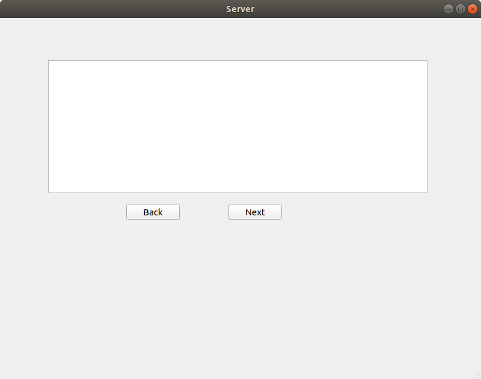

# Server for local TCP/IP connection
This program contain text browser and two buttons.
Text browser show messages of client and have buffer for last 10 messages.
Buttons are used for message navigation.
